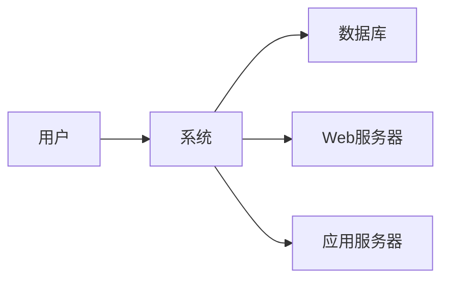

# 系统结构
## 架构设计
### 系统架构图
### 系统组件
### 总体运行逻辑
```
【异步任务】
执行功能属于agent的，例如主动数据采集，agent将获取的数据通过kafka转发给data模块，data处理完后写入数据库
agents --kafka--> databaseAgent ----> database 

执行功能属于service的，例如bgp路由接收、syslog接收，service将获取的数据通过kafka转发给data模块，data处理完后写入数据库
services --kafka--> databaseAgent ----> database 

databaseAgent也是属于agent的，它负责将kafka中的数据写入数据库

【同步任务】
执行功能属于service的，例如tacacs认证，service将获取的数据直接写入数据库并返回数据
services ----> functions ----> data ----> database
webServer ----> API ----> functions ----> data ----> database

```


## 系统模块
## 系统接口
## 系统流程

## 初始化数据库
```
create database netops;

use netops;
drop table IF EXISTS users;
create table users(
username varchar(40) COLLATE utf8_bin NOT NULL COMMENT '用户名',
identify varchar(64) COLLATE utf8_bin NOT NULL COMMENT '密码hash或API key',
subname varchar(40) COLLATE utf8_bin NOT NULL  DEFAULT '' COMMENT '中文名',
phone varchar(20) COLLATE utf8_bin NOT NULL  DEFAULT '' COMMENT '电话',
mail varchar(50) COLLATE utf8_bin NOT NULL  DEFAULT '' COMMENT '邮箱',
rid varchar(40) COLLATE utf8_bin NOT NULL  DEFAULT '' COMMENT '角色ID',
update_time varchar(10) COLLATE utf8_bin NOT NULL  DEFAULT '' COMMENT '最近更新时间',
last_login varchar(10) COLLATE utf8_bin NOT NULL  DEFAULT '' COMMENT '最近登陆时间',
primary key(username)
);

drop table IF EXISTS roles;
create table roles(
rid varchar(40) COLLATE utf8_bin NOT NULL COMMENT '角色ID',
name varchar(40) COLLATE utf8_bin NOT NULL COMMENT '角色名',
descr varchar(64) COLLATE utf8_bin NOT NULL DEFAULT '' COMMENT '角色描述',
primary key(rid)
);

drop table IF EXISTS role_pages;
create table role_pages(
rid varchar(40) COLLATE utf8_bin NOT NULL COMMENT '角色ID',
page_id bigint COLLATE utf8_bin NOT NULL COMMENT '页面ID',
privilege varchar(1) COLLATE utf8_bin NOT NULL DEFAULT '0'  COMMENT '页面权限 0 只读 1读写',
primary key(rid, page_id)
);

drop table IF EXISTS pages;
create table pages(
page_id bigint COLLATE utf8_bin NOT NULL AUTO_INCREMENT COMMENT '页面或目录ID',
name varchar(40) COLLATE utf8_bin NOT NULL COMMENT '页面名称',
classify varchar(40) COLLATE utf8_bin NOT NULL DEFAULT '' COMMENT '页面分类',
sort_num varchar(10) COLLATE utf8_bin NOT NULL DEFAULT '' COMMENT '同层排序',
path varchar(100) COLLATE utf8_bin NOT NULL DEFAULT '' COMMENT '路径',
p_type varchar(1) COLLATE utf8_bin NOT NULL DEFAULT '0' COMMENT '目录0or路由1',
descr varchar(300) COLLATE utf8_bin NOT NULL DEFAULT '' COMMENT '页面描述',
hide varchar(1) COLLATE utf8_bin NOT NULL DEFAULT '0' COMMENT '0是否隐藏，仅注册',
parent_id bigint COLLATE utf8_bin NOT NULL DEFAULT 0 COMMENT '归属',
icon varchar(40) COLLATE utf8_bin NOT NULL COMMENT '图标',
primary key(page_id)
);

drop table IF EXISTS pages_uri;
create table pages_uri(
uri_id bigint COLLATE utf8_bin NOT NULL AUTO_INCREMENT COMMENT '页面接口ID',
page_id bigint COLLATE utf8_bin NOT NULL COMMENT '页面ID',
uri varchar(60) COLLATE utf8_bin NOT NULL COMMENT '接口地址',
descr varchar(64) COLLATE utf8_bin NOT NULL DEFAULT '' COMMENT '接口描述',
privilege varchar(1) COLLATE utf8_bin NOT NULL DEFAULT '0'  COMMENT '页面权限 0 只读 1读写',
primary key(uri_id)
);


```