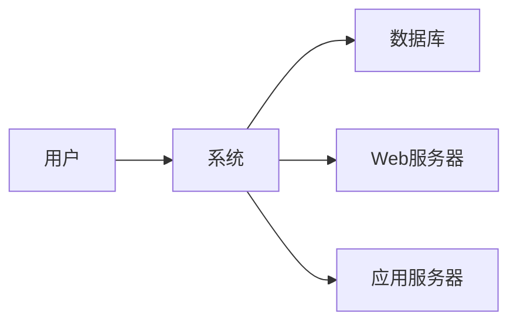

# 系统结构
## 架构设计
### 系统架构图
### 系统组件
### 总体运行逻辑
```
【异步任务】
执行功能属于agent的，例如主动数据采集，agent将获取的数据通过kafka转发给data模块，data处理完后写入数据库
agents --kafka--> databaseAgent ----> database 

执行功能属于service的，例如bgp路由接收、syslog接收，service将获取的数据通过kafka转发给data模块，data处理完后写入数据库
services --kafka--> databaseAgent ----> database 

databaseAgent也是属于agent的，它负责将kafka中的数据写入数据库

【同步任务】
执行功能属于service的，例如tacacs认证，service将获取的数据直接写入数据库并返回数据
services ----> functions ----> data ----> database
webServer ----> API ----> functions ----> data ----> database

```


## 系统模块
## 系统接口
## 系统流程